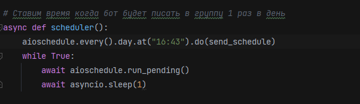
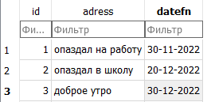
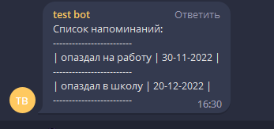
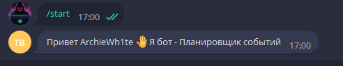
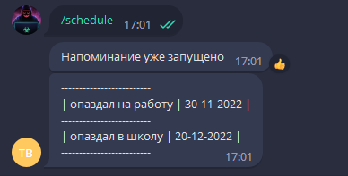
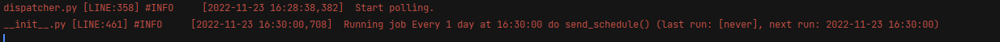

**Schedule AIOGramBot**

**Author:** @ArchieWh1te

**Language:** Python 3.8

**framework for Telegram** Aiogram 2.23.1 

**License:** Free


### Бот планировщик 


**Описание:**

Бот планировщик — который в указанное время отправляет сообщение в группу. 

**Вот так это все будет работать:**
+ Вы задаете время которое будет каждый день отправлять сообщение в группу.

**Запуск бота**

+ Все зависимости хранятся в файле `requirements.txt`

+ Для запуска бота используйте файл *```app.py```*

**Команды:**

```
/start - приветствие

/schedule - вывод сообщений из таблицы БД 

```
**Для работы вам потребуется:**

1)установить все зависимости из *requirements.txt*

2)Отредактировать файл **.env** там указываете токкен для бота.

```
BOT_TOKEN=тутваштоккен
```
3)Изменить настройки в файле **config** на свои параметры в переменной *admins* и *channel_id*.

``admins = [
   тут айдишники администраторов]
``

``
  channel_id = тут_ваш_айди_канала
``

4)Указать время для отправки сообщений в группу в файле *schedulers*


5)Изменить данные в БД SQLite на свои параметры



## Скриншоты

*Отправка сообщений в группу*



*Команда /start*



*Команда /schedule*



*Ответ в терминале когда выполнится отправка в группу*



